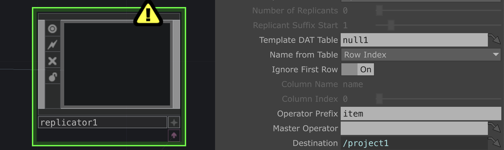
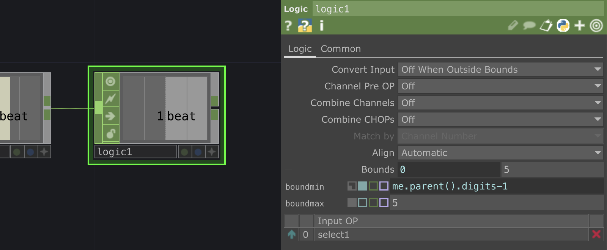

# Media transition in TD

## Import a media folder

To import all the medias, we will create a Replicator network. To understand or go further with Replicator networks, see [my tutorial](https://github.com/LucieMrc/TD_Replicator_EN).

Create a `Folder` DAT and in the "Root Folder" parameter, open the folder your media are in.

Create a `Null` DAT after the `Folder`, and create a `Replicator` COMP. We will use the replicator to create as many COMP as there is medias in the folder. Here, I have 4 images.

Drag and drop the `Null` DAT in the "Template DAT Table" parameter of the `Replicator`.

To create the Master operator, we create a 'Base' COMP that we drag and drop in the "Master Operator" parameter of the `Replicator`.

We go into the `Base` COMP and create a `Movie File In` TOP. We want to import the media of the row which number is the number of the COMP. So the "File" parameter of the `Movie File In` parameter would be "parent(2).op("null1")[me.parent().digits,'path']"

parent(2).op("null1") is the `Null1` DAT outside of the `Base` COMP
[me.parent().digits,'path'] is the row and the column in the DAT : 
- me.parent().digits is the number of the COMP which contains the `Movie File In`
- 'path' is the "path" column in the DAT.

Create and link a `Out` TOP, and exit the COMP.

If you click on the button "Recreate All Operators" in the `Replicator` parameters, you should see as many `Base` COMP as you have medias in your folder appearing with the image in it, named "item".

## Create the counter

To make the medias appears one by one, we need to have a counter.

We create a `Beat` CHOP, and connect it to a `Logic` CHOP. In the "Output" tab of the `Beat` parameters, turn off "Ramp" and turn on "Beat".

In the `Logic`, select "On when value changed" in the "Convert Input" parameter.

Connect it to a `Count` CHOP and your count should increase on each beat of the timeline.

We will need to reset the count at some point as it will continue to increase and we have a finite number of medias. We can either choose to reset it via a keyboard event, or to have the count loop between 0 and our number of medias, which is what I did.

## Medias appearing

To create the animation, let's go back into the master operator of the replicator, `Base1`.

We import the count into Base by creating a `Select` CHOP and writing "../count1" to select the `Count` CHOP outside of the Base.

We want the media appear when just before its number in the count, so we create a `Logic` CHOP and select "Off when outside bounds" in the "Convert Input" parameter.

In "Bounds", we write "me.parent().digits-1" in the minimum to have the number preceding the media's, and in the maximum we write the maximum of our medias (5 for me).

Then, we create a `Level` TOP between the `Movie File In` and the `Out`. In the "Post" tab of the parameters, we put the channel from the `Logic` CHOP as the "Opacity" parameter.

If you exit the Base, and you click on the button "Recreate All Operators" in the `Replicator` parameters, you should see each media appearing with the count.

## Create the transition

Back in the master operator `Base` COMP, we will now create the fade/keying animation.

After the `Select` CHOP, create a `Filter` CHOP. The "Width" parameter will be the speed of the animation, I chose 0.4s.

After the `Filter`, create a `Limit` CHOP. We want to clamp at the number of the base - 1 for the minimum and the number of the base for the maximum.

Then we create a `Math` CHOP. In the "Range" tab, we change the "From Range" to the same mininum and maximum as the `Limit` CHOP, "me.parent().digits-1" and "me.parent().digits".

In the "To Range", we change to 1 and 0.

Then we create a `Chroma Key` TOP between the `Level` and `Out` TOP. In the "Value" range of the parameters, we put the channel from the `Math` as the "Val Min".

If you exit the Base, and you click on the button "Recreate All Operators" in the `Replicator` parameters, you should see each media appearing with the transition effect.

## Compose all the medias

Create a `Composite` TOP, and in the "TOPs" parameter write "item*/out1" to select all the `Out` TOPs of the "item" COMPs.

As the Operation Mode, we choose "Over" and turn on "Swap Operation Order" so the medias appears on top of each other.

If you want to export the composition, you should turn off "realtime" in Touchdesigner parameters as the process can lag and you don't want dropped frames.

# To go further

- nothing yet